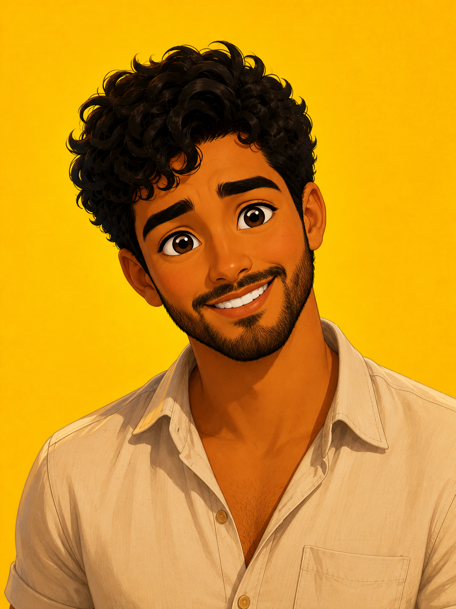
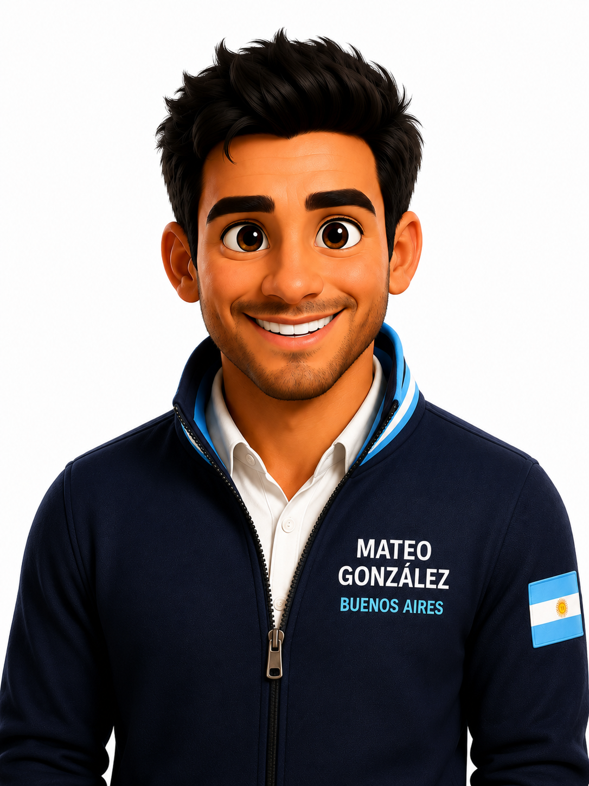

# 🇪🇸 Español Interactivo · A1

> Cada aula é uma aplicação web completa — HTML, CSS e JavaScript puro — com um personagem, uma história e uma tarefa final de fala. Abre no projetor da sala e no celular do aluno, sem instalar nada.

---

## 📚 Aulas

| Data | Personagem | Origem | Tema | Projeção | Celular |
|---|---|---|---|---|---|
| 16/05/2026 | Martina García | 🇪🇸 Madrid | Lugares da cidade · transportes · rotina semanal | [abrir](https://juanidives.github.io/espanhol/aulas/aula-2026-05-16/) | — |
| 23/05/2026 | Sebastián Mora | 🇨🇴 Medellín | Alimentos e comidas típicas da América Latina | [abrir](https://juanidives.github.io/espanhol/aulas/aula-2026-05-23/) | [abrir](https://juanidives.github.io/espanhol/aulas/aula-2026-05-23/mobile.html) |
| 13/06/2026 | Mateo González | 🇦🇷 Buenos Aires | Horas · esportes · a Copa do Mundo | [abrir](https://juanidives.github.io/espanhol/aulas/aula-2026-06-13/) | [abrir](https://juanidives.github.io/espanhol/aulas/aula-2026-06-13/mobile.html) |
| 15/08/2026 | Valentina Ríos | 🇲🇽 Cidade do México | Gostos e opiniões · *gustar* e semelhantes | [abrir](https://juanidives.github.io/espanhol/aulas/aula-2026-08-15/) | [abrir](https://juanidives.github.io/espanhol/aulas/aula-2026-08-15/mobile.html) |
| 22/08/2026 | Nicolás Quispe | 🇵🇪 Cusco | Possessivos e interrogativos · pronomes complemento | [abrir](https://juanidives.github.io/espanhol/aulas/aula-2026-08-22/) | [abrir](https://juanidives.github.io/espanhol/aulas/aula-2026-08-22/mobile.html) |
| 12/09/2026 | Lucía Paredes | 🇨🇷 San José | Pretérito perfecto simple · pretérito imperfecto | [abrir](https://juanidives.github.io/espanhol/aulas/aula-2026-09-12/) | [abrir](https://juanidives.github.io/espanhol/aulas/aula-2026-09-12/mobile.html) |

Cada aula é identificada pela data em que foi dada. As aulas de 15/08 e 22/08 têm ainda uma lacuna de informação em pares — `aluno-a.html` e `aluno-b.html`, um para cada metade da dupla.

---

## 🎭 Os personagens

<table>
  <tr>
    <td align="center"><br><sub><b>Martina</b><br>Madrid</sub></td>
    <td align="center"><br><sub><b>Sebastián</b><br>Medellín</sub></td>
    <td align="center"><br><sub><b>Mateo</b><br>Buenos Aires</sub></td>
  </tr>
  <tr>
    <td align="center"><br><sub><b>Valentina</b><br>Cidade do México</sub></td>
    <td align="center"><br><sub><b>Nicolás</b><br>Cusco</sub></td>
    <td align="center"><br><sub><b>Lucía</b><br>San José</sub></td>
  </tr>
</table>

Cada aula gira em torno de um personagem, com alternância de gênero entre aulas consecutivas e sotaque coerente com a origem — personagem argentino traz `vos` nas tabelas de conjugação, personagem peruano traz o vocabulário andino. As histórias se cruzam: o caderno que Nicolás guardava no albergue em Cusco é o que Lucía vem buscar na aula seguinte.

---

## 🗂️ Estrutura

```
espanhol/
└── aulas/
    └── aula-AAAA-MM-DD/
        ├── index.html      # projeção em sala — 100vw/100vh, fontes grandes
        ├── mobile.html     # celular do aluno — scroll vertical, swipe
        ├── aluno-a.html    # lacuna de informação em pares
        ├── aluno-b.html
        ├── images/
        └── audio/
```

Cada aula é autocontida: um `.html` é a apresentação inteira e continua funcionando offline depois de carregada.

---

## 🚀 Como usar

**Na sala** — abra o link de projeção no navegador, em tela cheia. Navegação por `→` / `←` ou pelos botões.

**No celular do aluno** — o link *mobile* é pensado para toque e scroll vertical, e a própria aula projeta o QR code que leva até ele. Funciona em qualquer aparelho, sem app.

**Localmente**

```bash
git clone https://github.com/juanidives/espanhol
cd espanhol/aulas/aula-2026-09-12
# abrir index.html no navegador — sem servidor, sem build
```

---

## 🛠️ Stack

```
HTML5 · CSS3 · JavaScript (vanilla) · GitHub Pages
```

Zero dependências, zero build step. A escolha é deliberada: qualquer professor consegue abrir o arquivo, entender e adaptar; a aula carrega rápido no 4G da sala e sobrevive a uma internet que cai no meio da explicação.

O layout responde ao contexto real de sala — fontes grandes e alto contraste para alunos com dificuldade visual, imagens em `object-fit: contain` para nunca cortar, e cada slide com a própria classe de layout.

---

## 🎯 A metodologia

Framework **Awareness → Appropriation → Autonomy**, com planejamento retroativo: define-se primeiro a tarefa final de produção oral e derivam-se os apoios a partir dela.

O teste que toda atividade oral precisa passar: *o aluno cumpre a tarefa só repetindo o modelo, ou precisa escolher e responder ao que o outro diz?* Se basta repetir, ainda é apoio — e o apoio existe para tornar o sucesso possível, mas precisa ser retirável.

A prioridade declarada pelos próprios alunos no fim do primeiro semestre: **falar**. É o critério que decide o desenho de cada aula.

---

## 👤 Sobre

Projeto voluntário de **Juan Antonio Morales** — profissional de dados, educador voluntário e entusiasta de tecnologia aplicada ao ensino. O objetivo de longo prazo é um livro didático A1 completo, aula por aula.

<p align="center">
  <sub>Español · Argentina e Brasil sempre no coração</sub>
</p>
